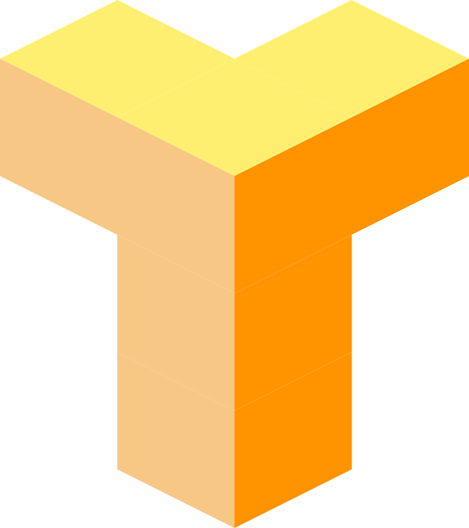

<h1> Talos3D Core</h1>

Talos3D is a 3D platform for authored geometry, AI-assisted design workflows,
and capability-based extensibility.

The project is being prepared as an open-source platform rather than a single
closed application. The core editing substrate, AI/model API, geometry
semantics, and capability registries are intended to be reusable by community
extensions, first-party domain packs, and private add-ons.

Recent work adds first steps toward a semantic assembly layer in the authored
model. That includes authored assemblies, typed semantic relations, capability
registered vocabulary, and MCP tools for inspecting and creating higher-order
structures such as rooms, storeys, and houses.

## Project Status

Talos3D is maintained on a time-permits basis by Appverket LLC. See
[GOVERNANCE.md](./GOVERNANCE.md) and [SUPPORT.md](./SUPPORT.md) for operating
boundaries and expectations.

The intended operating model is:

- a public platform core
- reference domain packs in this repository
- room for community, private, and commercial extensions outside it

## Featured: MCP Model API

Talos3D includes a structured Model Context Protocol surface for AI agents and
automation clients.

- Run it with `cargo run --features model-api`
- Connect over HTTP at `http://127.0.0.1:<port>/mcp`
- For parallel agent sessions, launch with a unique instance id and port:
  `cargo run --features model-api -- --instance-id codex --model-api-port 24842`
- Use the same command surface the UI uses for inspection and edits
- Discover capability vocabulary and inspect or create semantic assemblies and
  relations through the same public interface

Start with [docs/MCP_MODEL_API.md](./docs/MCP_MODEL_API.md).

## What Makes It Different

- AI-first authored model: AI reads and edits authored entities, definition
  graphs, and semantic geometry, not just render meshes.
- Capability platform: features are delivered as capabilities and bundled into
  setups. The architectural functionality in this repository is an example of a
  capability bundle, not a privileged special case.
- Extensible geometry stack: simple primitives, profile-based solids, authored
  features, evaluated bodies, and future DAG-based parameterized geometry can
  coexist under one model.
- Authored edge features: fillet and chamfer are first-class authored nodes,
  so the rounded/bevelled result stays editable through commands and MCP rather
  than becoming an opaque mesh.
- One command surface: keyboard, toolbar, menu, command palette, automation,
  and MCP all converge on the same command substrate.

## Current Scope

Talos3D already includes:

- a Rust + Bevy core platform
- a modeling capability with primitives, transforms, groups, face editing, and
  profile-based solids
- authored fillet and chamfer features with command and MCP-driven editing
- an architectural capability with walls, openings, BIM metadata, and
  wall-opening rules
- an MCP-backed model API
- first steps toward higher-order semantic structure through authored
  assemblies, typed relations, vocabulary descriptors, and model API tools
- semantic geometry summaries for AI inspection, including evaluated body facts
  such as connectedness and volume where supported

## Architecture In One View

```text
Core Platform
  -> shared ECS runtime, command/history, viewport, UI chrome, AI/model API

Capability Modules
  -> modeling, architecture, terrain, analysis, import/export, future domains

Workbenches
  -> curated workflows built from capabilities
```

The important boundary is capability, not workbench. A capability can be:

- open-source and community maintained
- a first-party reference extension
- a paid or private add-on distributed separately

The architectural capability in this repository should be read as a reference
extension that demonstrates how a domain package composes on top of the public
platform.

## Quick Start

Run the desktop app:

```bash
cargo run
```

Run with the model API / MCP server enabled:

```bash
cargo run --features model-api
```

## Documentation

Start here:

- [Docs Home](./docs/index.md)
- [MCP Model API](./docs/MCP_MODEL_API.md)
- [Developer Onboarding](./docs/DEVELOPER_ONBOARDING.md)
- [Product Overview](./docs/PRODUCT.md)
- [Platform Architecture](./docs/PLATFORM_ARCHITECTURE.md)
- [Extension Architecture](./docs/EXTENSION_ARCHITECTURE.md)
- [Capability Plugin API](./docs/CAPABILITY_PLUGIN_API.md)
- [System Architecture](./docs/SYSTEM_ARCHITECTURE.md)
- [Domain Model](./docs/DOMAIN_MODEL.md)
- [AGENTS.md](./AGENTS.md)

## Documentation Site

The public website/docs are intended to be generated directly from the Markdown
documents in this repository.

An MkDocs configuration is included:

```bash
mkdocs serve
```

## Contributing

See [CONTRIBUTING.md](./CONTRIBUTING.md). If you are considering a large
change, read [GOVERNANCE.md](./GOVERNANCE.md) first so expectations are clear
before you invest time.

## License

Talos3D is licensed under the [Apache License 2.0](./LICENSE).

See [NOTICE](./NOTICE) for attribution notices and
[TRADEMARKS.md](./TRADEMARKS.md) for name and logo usage. The Apache License
does not grant rights to Talos3D trademarks.

## Security

See [SECURITY.md](./SECURITY.md) for vulnerability reporting expectations.
