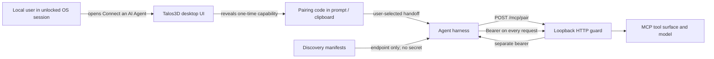
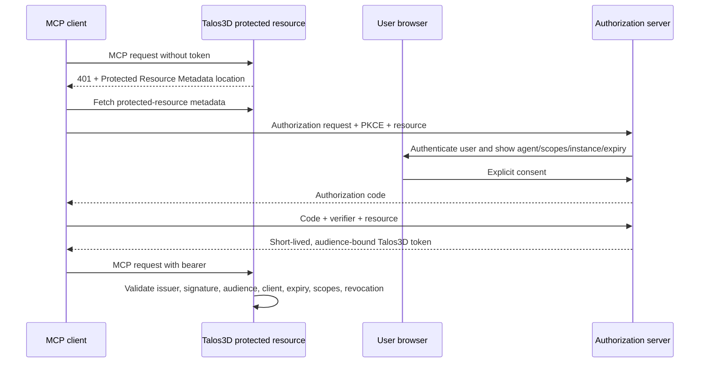

# Talos3D MCP Authentication Security Review

## Document status

- **Purpose:** implementation-specific input to an independent security review
- **Applies to:** `talos3d-core` local Model API at commit `ef5a002`
- **Protocol surface:** MCP over loopback Streamable HTTP and local stdio
- **Last reviewed against implementation:** 2026-07-22
- **Decision context:** workspace ADR-063, Agent Welcome and Session Negotiation

This document describes what the current implementation does, its intended
security properties, assumptions, known limitations, and the separate design
required for a future remote/shared service. It is not a claim that the local
pairing mechanism is suitable for an Internet-reachable deployment.

## Executive summary

The local desktop flow is a **user-mediated capability handoff**:

1. Talos3D binds the Model API only to loopback and creates two independent
   random process-local secrets: a pairing code and an MCP bearer.
2. A person who can operate the unlocked Talos3D desktop UI opens **Connect an
   AI Agent** and copies a generated prompt containing the pairing code.
3. The intended agent submits the pairing code once to `POST /mcp/pair`.
4. Talos3D atomically consumes the code and returns the separate MCP bearer.
5. Every subsequent HTTP MCP request must present that bearer. Both values die
   with the Talos3D process.

The flow establishes that *someone with access to the local Talos3D UI handed a
capability for this process to the first successful redeemer*. It does **not**
establish a named user, cryptographically identify the agent, bind the bearer to
the supplied `agent_name`, provide per-tool scopes, or authorize remote access.

The future remote/shared mode is a different protocol: OAuth discovery,
Authorization Code with PKCE, explicit user consent, resource/audience binding,
least-privilege scopes, short-lived tokens, revocation, and audit identity. It
is specified below as a reviewable requirement and is not implemented by the
local pairing code.

## Scope and non-goals

### In scope

- creation, delivery, redemption, validation, and expiry of local credentials;
- loopback, `Host`, and `Origin` enforcement;
- information written to discovery manifests and logs;
- the relationship among authentication, authorization, and capability
  profiles;
- stdio trust inheritance;
- threats at the browser/loopback, clipboard, local-process, and remote-service
  boundaries;
- required controls for a future remote deployment.

### Out of scope

- authorization correctness of every individual model-edit tool;
- prompt-injection resistance after a legitimately connected agent receives
  model or corpus content;
- operating-system account security, screen locking, malware prevention,
  process isolation, crash-dump policy, and clipboard-manager policy;
- confidentiality or integrity after the host or Talos3D process is compromised;
- identity and authorization of downstream services called by future tools.

Those exclusions are not declarations that the risks do not matter. They mark
where this protocol relies on the OS, deployment, agent harness, or a separate
authorization design.

## Assets and security objectives

| Asset | Classification | Required property |
|---|---|---|
| Pairing code | Short-lived secret capability | Confidential until first redemption; single use; instance/process bound |
| MCP bearer | Secret capability | Confidential; required on every HTTP MCP request; invalid after process exit |
| Authored model and filesystem paths | User data / integrity-sensitive | No access through HTTP MCP without the bearer |
| Talos3D process and command surface | Privileged local capability | Not driveable by cross-origin pages or DNS rebinding |
| Instance id, port, endpoint, PID, start time | Discovery metadata, not secret | May be locally discoverable; must not imply authorization |
| Agent name in pairing request | Untrusted label | Must not be treated as authenticated identity |
| Capability profile | Tool-surface filter | Must not be represented as authentication or authorization |

The local mechanism prioritizes model integrity and access control against
unpaired network clients and browser drive-bys. It does not attempt to defend a
user from another process running with equivalent local privileges.

## Actors and trust assumptions

| Actor | Trust position |
|---|---|
| Local Talos3D user | Trusted to decide which agent receives the prompt; authenticated only by the surrounding desktop/OS session |
| Talos3D process | Trusted computing base for credential generation, validation, model access, and UI delivery |
| Intended agent/harness | Trusted after it receives the prompt and bearer; responsible for not logging or persisting them |
| Web page in a local browser | Untrusted; must not be able to drive the loopback API cross-origin |
| Remote network peer | Cannot reach a correctly bound loopback listener |
| Other local process / malware | Outside the protection boundary; may be able to read clipboard, memory, environment, or loopback traffic depending on OS controls |
| Discovery client | May learn endpoint metadata; possession of discovery data grants no MCP access |

The phrase “authenticated user can summon the prompt” means that Talos3D
inherits user presence from the unlocked desktop session. Talos3D does not
currently perform an additional login, biometric check, or step-up challenge
when the dialog is opened.

## Trust boundaries



The most security-sensitive transition is the prompt/clipboard handoff. The
pairing code is a bearer capability until redeemed; the first successful
redeemer receives the MCP bearer.

## Current local HTTP protocol

### 1. Process initialization

The implementation in
`crates/talos3d-core/src/plugins/model_api/types.rs` creates a
`ModelApiAuthentication` resource containing:

- `pairing_code`;
- `access_token`;
- an atomic `paired` flag, initially `false`.

By default, each secret is `talos3d_` followed by two independent UUIDv4 simple
forms. After UUID version and variant bits, the implementation documents 244
random bits per secret. The pairing code and bearer are generated independently.

`TALOS3D_MODEL_API_TOKEN` may replace the generated **pairing code** for a
repeatable local test harness. It must contain at least 32 non-whitespace
characters. It does not replace the separately generated MCP bearer. This
override is not an entropy guarantee and should not be used as a production
credential source.

The listener binds to `127.0.0.1` only. The preferred port is configurable; if
the default port is occupied and no port was explicitly requested, Talos3D asks
the OS for an available loopback port.

### 2. Discovery

The registry manifest and optional repo-local `.mcp.json` files contain the
instance id, app name, PID, loopback address/port, endpoint, start time, and
authentication *method metadata*. They contain neither secret.

The registry advertises:

```json
{
  "authentication": {
    "type": "local_one_time_pairing_then_bearer",
    "required": true,
    "pairing_endpoint": "http://127.0.0.1:<port>/mcp/pair",
    "pairing_grant_delivery": "authenticated_in_app_onboarding_prompt",
    "access_token_delivery": "one_time_pairing_response",
    "remote_requirement": "oauth_2_1_authorization_code_pkce_with_mcp_discovery"
  }
}
```

Discovery artifacts are cleaned up when the runtime cleanup resource is
dropped. Stale discovery records are possible after abnormal termination and
must be treated only as endpoint hints, never as proof of a live or authorized
instance.

### 3. User-mediated prompt delivery

The desktop dialog reads the live `ModelApiAuthentication` pairing code and
builds a prompt containing:

- exact MCP endpoint and expected instance id;
- `POST /mcp/pair` instructions;
- the one-time pairing code;
- instructions to keep both credentials out of logs and persistent storage;
- the required first Agent Hello / Welcome negotiation and instance check.

The MCP bearer is not present in the UI or prompt. The prompt remains sensitive
until the pairing code is redeemed or the process exits.

### 4. Pairing redemption

Request:

```http
POST /mcp/pair HTTP/1.1
Host: 127.0.0.1:<port>
Content-Type: application/json

{"pairing_code":"<one-time capability>","agent_name":"<untrusted label>"}
```

Successful response:

```json
{
  "access_token": "<separate process-local secret>",
  "token_type": "Bearer",
  "expires_when": "talos3d_instance_process_exits",
  "authentication_assurance": "local_user_mediated_one_time_pairing"
}
```

The pairing code is compared against the stored value and then consumed with an
atomic `compare_exchange(false, true)`. Concurrent attempts can produce only
one successful transition. A wrong code, second redemption, or replay returns
`401 Unauthorized`.

`agent_name` is accepted for protocol ergonomics but is currently discarded.
It is not authenticated, persisted, or bound to the bearer.

### 5. Authenticated MCP requests

All HTTP paths other than `/mcp/pair` require an exact header match:

```http
Authorization: Bearer <access_token>
```

The bearer is rejected before pairing succeeds. Missing, malformed, or wrong
credentials return `401 Unauthorized`. Credential comparison uses the local
constant-time byte comparison for equal-length values; differing lengths are
rejected immediately.

The bearer can be used on the default `/mcp` endpoint and the named profile
endpoints exposed by the same process. It is an instance capability, not a
scope-bearing authorization token.

### 6. Expiry and cleanup

The pairing code and bearer exist in process memory and have no independent
wall-clock TTL. Both become unusable when the process exits and a new process
generates fresh values. There is currently no user-facing revoke, rotate, or
disconnect operation short of terminating the app.

## Loopback access guard

Pairing and MCP routes share middleware that applies these checks before route
handling:

1. `Host` is mandatory and must exactly match the current port at
   `127.0.0.1`, `localhost`, or `[::1]`.
2. If `Origin` is present, it must exactly match the corresponding loopback
   origin and current port.
3. Guard failure returns `403 Forbidden`.
4. After the guard, all paths except `/mcp/pair` require the bearer.

This is defense in depth:

- loopback binding prevents ordinary remote network reachability;
- exact `Host` validation blocks a DNS-rebinding hostname that resolves to
  loopback;
- `Origin` validation blocks ordinary cross-origin browser fetches;
- the pairing code/bearer blocks unpaired non-browser clients and local pages
  that otherwise pass network routing checks.

Non-browser MCP clients commonly omit `Origin`; that is permitted when `Host`
is valid. Consequently, `Origin` is not an authentication factor.

## Security state reported to agents

After transport authentication, `negotiate_agent_session` reports:

- `authentication_assurance`:
  `instance_bound_ephemeral_bearer_from_one_time_pairing`;
- `authorization_assurance`:
  `local_user_mediated_pairing_for_this_running_instance`;
- `delegated_identity: false`;
- `capability_profile_is_authorization: false`.

This wording is intentionally narrow. It prevents an agent or reviewer from
mistaking bearer possession for named-user identity or treating a capability
profile as an authorization grant.

## Capability profiles and authorization

Profiles (`authoring`, `inspection`, `curation`, and others) reduce the tool
catalog exposed at a particular endpoint. In the current local implementation:

- the bearer is not bound to one profile;
- profile selection is not derived from an authenticated principal or policy;
- a bearer holder can address any enabled profile endpoint;
- tools continue enforcing their own semantic validation and command rules, but
  there is no per-principal scope decision.

Therefore profiles are context/tool-surface filters only. A security review
must assess the bearer as granting access to the complete enabled local Model
API surface, including model mutation and filesystem-oriented project tools.

## Stdio transport

The stdio MCP transport does not use the HTTP pairing flow. It inherits trust
from the parent process or harness that launches and owns the channel. Agent
Welcome reports this as `inherited_parent_process_channel` and does not claim a
delegated identity. A deployment that exposes stdio across a less trusted
boundary must add authentication and authorization outside Talos3D or must not
expose the channel.

## Secret handling and observability

### Current controls

- Pairing code and bearer are not serialized into model data, discovery
  manifests, `.mcp.json`, `InstanceInfo`, or Agent Welcome.
- The `Debug` implementation renders both secrets as `<redacted>`.
- Startup logging includes instance id, MCP URL, and registry path, not secrets.
- The bearer is delivered in the JSON response body, never in a URL.
- Subsequent credentials use the `Authorization` header, never a query string.
- The onboarding prompt tells clients not to log or persist either value.

### Places where a secret can still appear

- the visible onboarding dialog;
- the system clipboard and any clipboard history/synchronization service;
- the agent prompt/context and harness memory;
- the pairing HTTP request body and response body on loopback;
- the HTTP `Authorization` header;
- Talos3D and agent process memory, swap, diagnostics, or crash dumps;
- screenshots or recordings made while the onboarding dialog is visible;
- shell history or process environments if the test override is provisioned
  unsafely.

The implementation does not zeroize the Rust strings on drop and does not
control third-party harness telemetry. Reviewers should treat those as explicit
residual risks.

## Threat model

| Threat | Primary control | Residual risk / disposition |
|---|---|---|
| Remote peer invokes MCP | IPv4 loopback-only bind | Host networking, port forwarding, proxies, or container configuration can invalidate the assumption; remote exposure is forbidden |
| Malicious website drives local MCP | Exact `Host`, exact present `Origin`, bearer requirement | Browser extensions, compromised browsers, or non-browser local malware are outside this control |
| DNS rebinding to loopback | Exact allowlisted `Host` including port | A cooperating local proxy could rewrite headers; outside ordinary browser threat |
| Pairing-code brute force | 244 random bits by default; constant-time equal-length compare | No rate limit or lockout; a low-entropy configured test code weakens the property |
| Pairing prompt replay | Atomic single-use flag | First-redeemer-wins race remains; a thief who redeems first receives the bearer |
| Pairing code used directly as bearer | Independently generated access token | Correctly rejected; credential types have no cryptographic binding beyond in-process state |
| Bearer theft | Process-local randomness; no persistence; process-exit expiry | Bearer is reusable for process lifetime, unscoped, and has no revoke/idle timeout |
| Agent impersonation via `agent_name` | Field is ignored for security decisions | No authenticated agent identity or audit binding exists locally |
| Capability-profile escalation | Profiles are explicitly not authorization | Bearer holder can use enabled profile endpoints; local bearer must be treated as full Model API capability |
| Credential leakage through logs/manifests | Redacted `Debug`; manifests contain metadata only | Application/harness HTTP tracing, clipboard tools, crash dumps, or manual logging can still leak values |
| Local malicious process | None beyond OS process/user isolation | Accepted limitation of the local desktop mode |
| Stale discovery artifact | Bearer still required; instance id confirmation in onboarding | May cause connection confusion or availability failures, not authorization by itself |
| CSRF against pairing endpoint | JSON body secret plus `Host`/`Origin` guard | Pair endpoint has no bearer by design; compromise of prompt/clipboard remains decisive |
| Denial of service through pairing races | Atomic first redemption | A thief can consume the grant and deny the intended agent; no regenerate/cancel UX exists yet |

## Known limitations and review findings

These are current properties, not hidden future work:

1. **First redeemer wins.** The code is a bearer capability and is not bound to
   an agent public key, process, callback channel, or attestation.
2. **No pairing-code TTL.** An unredeemed code remains valid until process exit.
3. **No bearer revocation or idle expiry.** Terminating Talos3D is the only
   current revocation mechanism.
4. **No least-privilege scopes.** The local bearer is valid across enabled
   profile endpoints; profile names are not authorization policy.
5. **No authenticated identity or audit subject.** `agent_name` is untrusted and
   discarded.
6. **No rate limiting.** Default entropy makes online guessing impractical, but
   configured codes can have materially less entropy.
7. **No explicit `Cache-Control: no-store` documented on pairing responses.**
   Loopback/no-proxy is assumed, but the response carries a credential.
8. **No memory zeroization.** Secrets may remain in allocator memory and dumps.
9. **Clipboard exposure.** Clipboard managers, synchronization, screenshots,
   and unrelated local applications may capture the prompt.
10. **Local plaintext HTTP.** Acceptable only under the strict loopback/local
    threat model; it must never be repurposed for remote access.
11. **Test override quality is caller-controlled.** Length and whitespace checks
    do not prove entropy.
12. **No step-up confirmation for high-risk tools.** Command authorization is a
    separate product/security layer.

## Recommended hardening backlog

An independent reviewer should validate priorities, but the expected sequence
is:

1. Add short pairing expiry plus **Regenerate** and **Cancel** controls in the
   desktop UX.
2. Add bearer revocation/disconnect and bounded idle/absolute lifetimes.
3. Return `Cache-Control: no-store` and `Pragma: no-cache` on pairing responses.
4. Rate-limit failed pairing attempts per process and emit a redacted security
   event without logging candidate codes.
5. Restrict or clearly gate `TALOS3D_MODEL_API_TOKEN` to test/development use and
   require an entropy-bearing format when enabled outside tests.
6. Consider an OS-native IPC transport or a proof-of-possession pairing exchange
   to reduce clipboard and first-redeemer risk.
7. Bind issued credentials to explicit local scopes only when profiles become
   enforceable authorization policy; do not relabel the current profile filter.
8. Add user-visible connected-agent state, grant metadata, last-use time, and a
   disconnect action without claiming identity that has not been verified.
9. Zeroize credential buffers where practical and document crash-dump policy.
10. Add live HTTP integration tests for security headers, concurrent redemption,
    error uniformity, expiry/revocation when implemented, and absence of secrets
    from every discovery/logging surface.

## Remote/shared mode: mandatory separate design

The local protocol must not be widened to `0.0.0.0`, placed behind a public
proxy, or described as remote authentication. A remote/shared Talos3D service
must implement the MCP authorization model:



Required properties:

- Protected Resource Metadata (RFC 9728) and authorization-server discovery;
- Authorization Code flow with PKCE S256;
- the MCP `resource` parameter in authorization and token requests;
- tokens issued specifically for the canonical Talos3D MCP resource and
  validated for that audience;
- explicit consent identifying authenticated user, agent/client, Talos3D
  instance or tenant, requested scopes, and grant duration;
- least-privilege and step-up scopes mapped to enforceable server policy;
- short-lived access tokens, refresh-token rotation where applicable,
  revocation, logout/disconnect, and audit binding;
- HTTPS for every non-loopback endpoint;
- no access token, refresh token, API key, client secret, or reusable pairing
  secret in the onboarding prompt;
- no inbound-token passthrough to downstream APIs. Downstream credentials must
  be separately issued for the downstream resource.

This structure follows the current MCP authorization specification,
Cloudflare's separation of login, consent, scopes, and MCP tokens, and AWS
AgentCore's discovery-, audience-, client-, scope-, and claim-based inbound JWT
validation. Talos3D does not require vendor compatibility with either platform.

## Security verification evidence

### Automated tests

The focused transport suite is run with:

```bash
cargo test -p talos3d-core --features model-api runtime_transport::tests --lib
```

At the implementation snapshot it covers:

- exact bearer acceptance;
- missing and wrong bearer rejection;
- independently generated unique credentials and debug redaction;
- pre-pair bearer rejection;
- one-time pairing and replay rejection;
- configured-code input validation;
- permitted loopback hosts and same-origin requests;
- rejection of missing `Host`, DNS-rebinding host, cross-origin browser request,
  and wrong port;
- discovery-config merge/cleanup behavior.

The Agent Welcome test additionally verifies that HTTP sessions report the
pairing-derived assurance, do not claim delegated identity, and do not treat
profiles as authorization.

### Live proof

A fresh code-blind agent session on 2026-07-22 demonstrated:

- successful one-time pairing and separate bearer use;
- HTTP 401 for pairing-code replay;
- HTTP 401 for unauthenticated MCP initialization;
- correct expected-instance and assurance confirmation;
- complete authenticated bootstrap and authoring session;
- process termination invalidating the session credential.

See the workspace `proof_points/PROOF_POINT_219.md` for the end-to-end trace.

## Reviewer checklist

The security review should answer at least:

- Are the stated local threat boundary and excluded local-malware risks
  acceptable for the product?
- Is 244-bit UUIDv4-derived randomness implemented and sourced as expected on
  every supported platform?
- Can any log, panic, tracing middleware, clipboard integration, or crash report
  expose request/response headers or bodies?
- Are `Host` and `Origin` semantics correct behind every supported desktop,
  container, IPv4, and IPv6 configuration?
- Can concurrent redemption ever return the bearer more than once?
- Should pairing failure responses be normalized further against side channels?
- What TTL, revocation, scope, and user-visible connection state are required
  before production release?
- Can the configured pairing-code override be disabled or isolated from
  production packaging?
- Are filesystem permissions and stale cleanup for local discovery metadata
  acceptable on every supported OS?
- Which high-risk model/file operations require independent authorization or
  confirmation after transport authentication?
- Does the remote design enforce audience, issuer, client, scope, expiry,
  revocation, and no-token-passthrough at the resource server?

## Implementation map

| Concern | Implementation |
|---|---|
| Credential state, generation, redemption, comparison, redaction | `crates/talos3d-core/src/plugins/model_api/types.rs` — `ModelApiAuthentication` |
| Listener, pairing route, access middleware, discovery manifests | `crates/talos3d-core/src/plugins/model_api/transport.rs` |
| Reported session assurance | `crates/talos3d-core/src/plugins/model_api/server.rs` — `ModelApiTransportSecurity` |
| User-visible prompt and copy UX | `crates/talos3d-core/src/plugins/egui_chrome.rs` — `build_agent_onboarding_prompt` and connection window |
| Focused transport tests | `crates/talos3d-core/src/plugins/model_api/transport.rs` — `runtime_transport::tests` |
| Agent Welcome regression | `crates/talos3d-core/src/plugins/model_api/tests.rs` |
| Operational Model API docs | `docs/MCP_MODEL_API.md` |

## Standards and industry references

- [MCP Authorization specification](https://modelcontextprotocol.io/specification/2025-11-25/basic/authorization)
- [MCP security best practices](https://modelcontextprotocol.io/docs/tutorials/security/authorization)
- [OAuth 2.0 Security Best Current Practice, RFC 9700](https://www.rfc-editor.org/rfc/rfc9700.html)
- [OAuth 2.0 Protected Resource Metadata, RFC 9728](https://www.rfc-editor.org/rfc/rfc9728.html)
- [OAuth 2.0 Resource Indicators, RFC 8707](https://www.rfc-editor.org/rfc/rfc8707.html)
- [Proof Key for Code Exchange, RFC 7636](https://www.rfc-editor.org/rfc/rfc7636.html)
- [Cloudflare MCP authorization](https://developers.cloudflare.com/agents/model-context-protocol/protocol/authorization/)
- [AWS AgentCore inbound JWT authorization](https://docs.aws.amazon.com/bedrock-agentcore/latest/devguide/inbound-jwt-authorizer.html)
- [AWS AgentCore runtime security best practices](https://docs.aws.amazon.com/bedrock-agentcore/latest/devguide/runtime-security-best-practices.html)
